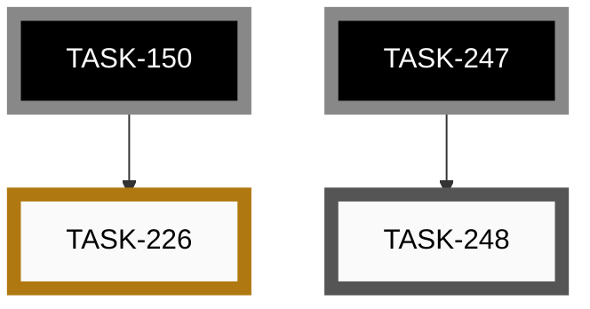
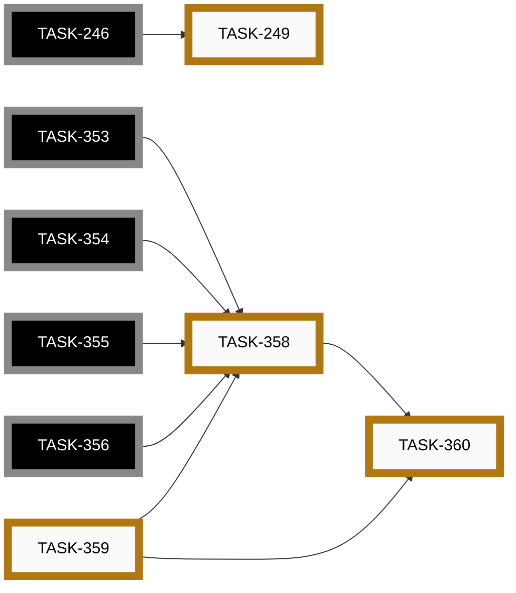
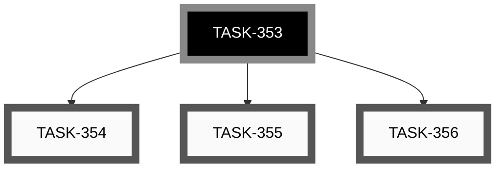
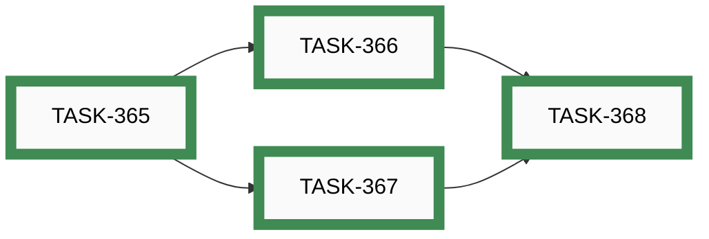
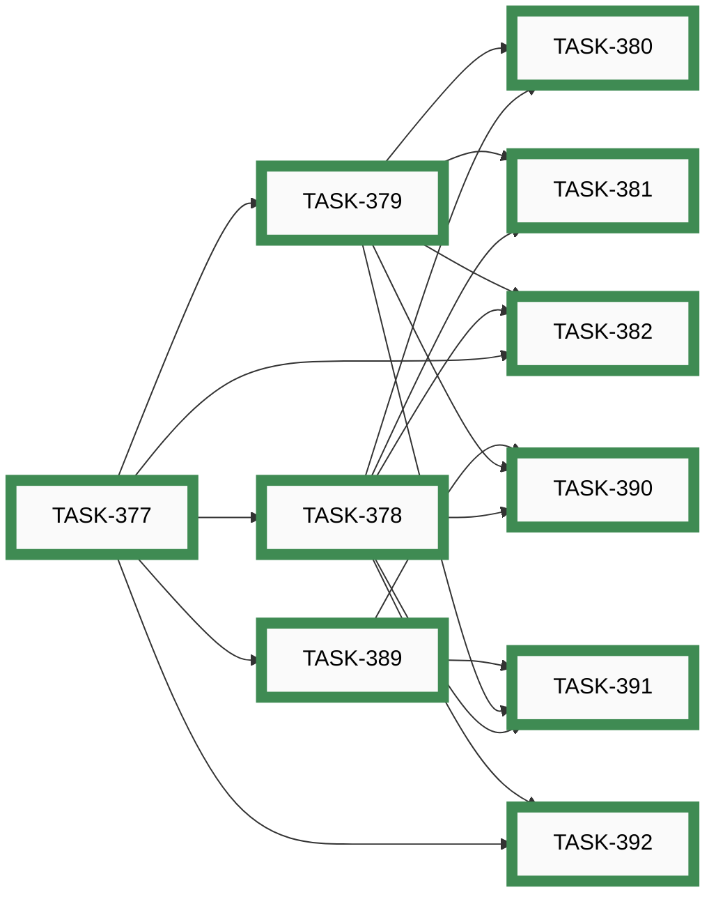
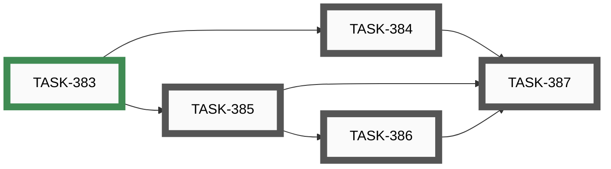
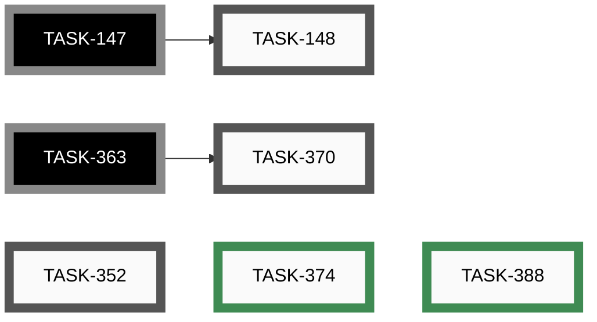

# Epics

_Auto-generated by `housekeep.py`. Do not edit manually._

**Overall:** 🔵 **active** — ████░░░░░░ 19/45 (42%) across 11 groups — 19 open · 0 active · 7 paused · 19 closed

## Index

| Epic | Title | Status | Open | Active | Paused | Closed | Done |
|------|-------|--------|-----:|-------:|-------:|-------:|------|
| [EPIC-012](#epic-012-app-store-distribution) | App store distribution | ⚪ _open_ | 1 | 0 | 0 | 0 | ░░░░░░░░░░ 0% |
| [EPIC-014](#epic-014-end-to-end-feature-tests) | End-to-end feature tests | 🔵 **active** | 1 | 0 | 1 | 0 | ░░░░░░░░░░ 0% |
| [EPIC-017](#epic-017-video-content-and-channel) | Video content and channel | ⚪ _open_ | 7 | 0 | 0 | 0 | ░░░░░░░░░░ 0% |
| [EPIC-019](#epic-019-iphone-app--build-test-and-ship) | iPhone app — build, test and ship | 🔵 **active** | 0 | 0 | 2 | 0 | ░░░░░░░░░░ 0% |
| [EPIC-025](#epic-025-nrf52840-hardware-blocked-work) | nRF52840 hardware-blocked work | 🔵 **active** | 0 | 0 | 4 | 0 | ░░░░░░░░░░ 0% |
| [EPIC-026](#epic-026-pedal-details-app-pages--firmware-readback-surfaces) | Pedal-details app pages — firmware readback surfaces | ⚪ _open_ | 3 | 0 | 0 | 0 | ░░░░░░░░░░ 0% |
| [EPIC-027](#epic-027-ble-services-developer-guide) | BLE services developer guide | 🟢 closed | 0 | 0 | 0 | 4 | ██████████ 100% |
| [EPIC-028](#epic-028-configurable-button-debounce-in-the-hardware-config) | Configurable button debounce in the hardware config | 🟢 closed | 0 | 0 | 0 | 2 | ██████████ 100% |
| [EPIC-029](#epic-029-named-pins--portable-pin-vocabulary-for-shareable-profiles) | Named pins — portable pin vocabulary for shareable profiles | 🟢 closed | 0 | 0 | 0 | 10 | ██████████ 100% |
| [EPIC-030](#epic-030-interactive-wiringsolder-test-tool) | Interactive wiring/solder test tool | 🔵 **active** | 4 | 0 | 0 | 1 | ██░░░░░░░░ 20% |
| [—](#unassigned) | _(no epic)_ | 🔵 **active** | 3 | 0 | 0 | 2 | ████░░░░░░ 40% |

---

## EPIC-012: App store distribution

[↑ back to top](#index)

**Status:** ⚪ _open_ — ░░░░░░░░░░ 0/1 (0%)

```mermaid
graph LR
    TASK_160["TASK-160"]:::open
    click TASK_160 "open/task-160-publish-android-play-store.md"
    classDef open    fill:#FAFAFA,stroke:#555,stroke-width:8px,color:#000
    classDef active  fill:#FAFAFA,stroke:#1A6FA8,stroke-width:8px,color:#000
    classDef closed  fill:#FAFAFA,stroke:#3F8B53,stroke-width:8px,color:#000
    classDef paused  fill:#FAFAFA,stroke:#B07810,stroke-width:8px,color:#000
    classDef openExt    fill:#000,stroke:#888,stroke-width:8px,color:#FFF
    classDef activeExt  fill:#000,stroke:#3FA9F5,stroke-width:8px,color:#FFF
    classDef closedExt  fill:#000,stroke:#7CC68A,stroke-width:8px,color:#FFF
    classDef pausedExt  fill:#000,stroke:#F0B030,stroke-width:8px,color:#FFF
```

| Order | ID | Title | Status | Effort |
|-------|----|-------|--------|--------|
| 2 | [TASK-160](open/task-160-publish-android-play-store.md) | Publish app to Google Play Store | ⚪ _open_ | Large (8-24h) |

## EPIC-014: End-to-end feature tests

[↑ back to top](#index)

**Status:** 🔵 **active** — ░░░░░░░░░░ 0/2 (0%)

| Order | ID | Title | Status | Effort |
|-------|----|-------|--------|--------|
| 2 | [TASK-248](open/task-248-ble-pairing-test-windows-fallback.md) | BLE pairing test — Windows manual fallback (and macOS if a host appears) | ⚪ _open_ | Small (&lt;2h) |
| 1 | [TASK-226](paused/task-226-feature-test-cli-scan-two-pedals.md) | Feature Test — CLI scan with two pedals (S-04) | 🟡 **paused** | Small (&lt;2h) |

## EPIC-017: Video content and channel

[↑ back to top](#index)

**Status:** ⚪ _open_ — ░░░░░░░░░░ 0/7 (0%)

| Order | ID | Title | Status | Effort |
|-------|----|-------|--------|--------|
| 1 | [TASK-033](open/task-033-create-setup-installation-demo-video.md) | Create Setup/Installation Demo Video | ⚪ _open_ | Large (8-24h) |
| 2 | [TASK-034](open/task-034-create-button-configuration-demo-video.md) | Create Button Configuration Demo Video | ⚪ _open_ | Large (8-24h) |
| 3 | [TASK-035](open/task-035-create-builder-workflow-demo-video.md) | Create Builder Workflow Demo Video | ⚪ _open_ | Large (8-24h) |
| 4 | [TASK-036](open/task-036-create-advanced-features-demo-video.md) | Create Advanced Features Demo Video | ⚪ _open_ | Extra Large (24-40h) |
| 5 | [TASK-037](open/task-037-create-real-world-usage-demo-video.md) | Create Real-World Usage Demo Video | ⚪ _open_ | Extra Large (24-40h) |
| 6 | [TASK-038](open/task-038-create-troubleshooting-demo-video.md) | Create Troubleshooting Demo Video | ⚪ _open_ | Large (8-24h) |
| 7 | [TASK-049](open/task-049-setup-video-platform-channel.md) | Setup video platform channel | ⚪ _open_ | Small (&lt;2h) |

## EPIC-019: iPhone app — build, test and ship

[↑ back to top](#index)

**Status:** 🔵 **active** — ░░░░░░░░░░ 0/2 (0%)

| Order | ID | Title | Status | Effort |
|-------|----|-------|--------|--------|
| 1 | [TASK-158](paused/task-158-feature-test-ios-build-deploy.md) | Feature Test — Build, deploy and test the iOS app on iPhone | 🟡 **paused** | Medium (4-8h) |
| 2 | [TASK-161](paused/task-161-publish-ios-app-store.md) | Publish app to Apple App Store | 🟡 **paused** | Large (8-24h) |

## EPIC-025: nRF52840 hardware-blocked work

[↑ back to top](#index)

**Status:** 🔵 **active** — ░░░░░░░░░░ 0/4 (0%)

| Order | ID | Title | Status | Effort |
|-------|----|-------|--------|--------|
| 1 | [TASK-359](paused/task-359-remove-nrf5-task-routing-skill.md) | Remove nrf5-task-routing skill once nRF52840 hardware is available | 🟡 **paused** | XS (&lt;30m) |
| 2 | [TASK-358](paused/task-358-nrf52840-ble-readback-surfaces.md) | nRF52840 BLE readback surfaces (firmware-version DIS + config readback + active-profile notify) | 🟡 **paused** | Large (8-24h) |
| 3 | [TASK-360](paused/task-360-nrf52840-esp32-parity-audit.md) | nRF52840 — verify functional parity with ESP32 across the codebase | 🟡 **paused** | Medium (2-8h) |
| 4 | [TASK-249](paused/task-249-nrf52840-pairing-pin-unwired.md) | nRF52840 pairing_pin is entirely unwired (security parity with ESP32) | 🟡 **paused** | Medium (2-8h) |

## EPIC-026: Pedal-details app pages — firmware readback surfaces

[↑ back to top](#index)

**Status:** ⚪ _open_ — ░░░░░░░░░░ 0/3 (0%)

| Order | ID | Title | Status | Effort |
|-------|----|-------|--------|--------|
| 1 | [TASK-354](open/task-354-firmware-version-read-characteristic.md) | Firmware — expose firmware-version read characteristic (+ DIS 0x180A decision) | ⚪ _open_ | Small (&lt;2h) |
| 2 | [TASK-355](open/task-355-firmware-config-readback.md) | Firmware — config readback (option chosen in TASK-353) | ⚪ _open_ | Medium (2-8h) |
| 3 | [TASK-356](open/task-356-firmware-active-profile-notify.md) | Firmware — active-profile-index notify characteristic | ⚪ _open_ | Small (&lt;2h) |

## EPIC-027: BLE services developer guide

[↑ back to top](#index)

**Status:** 🟢 closed — ██████████ 4/4 (100%)

| Order | ID | Title | Status | Effort |
|-------|----|-------|--------|--------|
| 1 | ~~[TASK-365](closed/task-365-scope-ble-services-guide.md)~~ | ~~Scope the BLE services developer guide — file structure and existing-doc disposition~~ | 🟢 closed | Small (&lt;2h) |
| 2 | ~~[TASK-366](closed/task-366-draft-catalog-and-recipe-sections.md)~~ | ~~Draft Service catalog + Recipe sections of the BLE services guide (with TASK-354 worked example)~~ | 🟢 closed | Medium (2-8h) |
| 3 | ~~[TASK-367](closed/task-367-draft-conventions-invariants-gotchas.md)~~ | ~~Draft Conventions, Cross-cutting invariants, and Gotchas sections of the BLE services guide~~ | 🟢 closed | Medium (2-8h) |
| 4 | ~~[TASK-368](closed/task-368-draft-tests-references-and-verify.md)~~ | ~~Draft Tests + References sections of the BLE services guide; verify success criterion; close epic~~ | 🟢 closed | Small (&lt;2h) |

## EPIC-028: Configurable button debounce in the hardware config

[↑ back to top](#index)

**Status:** 🟢 closed — ██████████ 2/2 (100%)

| Order | ID | Title | Status | Effort |
|-------|----|-------|--------|--------|
| 1 | ~~[TASK-375](closed/task-375-add-debouncems-to-hardware-config-schema-and-model.md)~~ | ~~Add debounceMs to hardware-config schema, example JSON, and Dart model~~ | 🟢 closed | Small (&lt;2h) |
| 2 | ~~[TASK-376](closed/task-376-esp32-button-reads-debouncems-from-hardware-config.md)~~ | ~~ESP32 — Button reads debounceMs from the loaded hardware config~~ | 🟢 closed | Small (&lt;2h) |

## EPIC-029: Named pins — portable pin vocabulary for shareable profiles

[↑ back to top](#index)

**Status:** 🟢 closed — ██████████ 10/10 (100%)

| Order | ID | Title | Status | Effort |
|-------|----|-------|--------|--------|
| 1 | ~~[TASK-377](closed/task-377-define-v1-standard-pin-name-set.md)~~ | ~~Define the v1 standard pin-name set and pick its canonical home~~ | 🟢 closed | Small (&lt;2h) |
| 2 | ~~[TASK-378](closed/task-378-hardware-config-pinnames-mapping.md)~~ | ~~Hardware config — pinNames mapping (physical pin → standard name)~~ | 🟢 closed | Small (&lt;2h) |
| 3 | ~~[TASK-379](closed/task-379-profile-schema-accept-named-pin-references.md)~~ | ~~Profile schema — accept named-pin references alongside direct pin IDs~~ | 🟢 closed | Small (&lt;2h) |
| 4 | ~~[TASK-380](closed/task-380-esp32-resolve-named-pins-at-config-load.md)~~ | ~~ESP32 firmware — resolve named-pin references at config load~~ | 🟢 closed | Medium (2-8h) |
| 5 | ~~[TASK-381](closed/task-381-configurator-named-pin-ux-autocomplete-validation-warning.md)~~ | ~~Configurator / app UX — autocomplete, validation, and missing-mapping warning for named pins~~ | 🟢 closed | Medium (2-8h) |
| 6 | ~~[TASK-382](closed/task-382-named-pins-builder-docs-and-github-addition-process.md)~~ | ~~Named pins — builder docs and GitHub process for proposing additions~~ | 🟢 closed | Small (&lt;2h) |
| 7 | ~~[TASK-389](closed/task-389-pin-names-catalog-service.md)~~ | ~~PinNamesCatalog service — Flutter-side reader of pin-names.schema.json~~ | 🟢 closed | Small (&lt;2h) |
| 8 | ~~[TASK-390](closed/task-390-action-editor-named-pin-ux.md)~~ | ~~Action editor (Flutter) — named-pin picker with autocomplete and inline mapping hint~~ | 🟢 closed | Medium (2-8h) |
| 9 | ~~[TASK-391](closed/task-391-missing-mapping-warning-surfaces.md)~~ | ~~Missing-mapping warning surfaces — profile editor + connected-pedal page~~ | 🟢 closed | Small (&lt;2h) |
| 10 | ~~[TASK-392](closed/task-392-js-config-builder-pinnames-ux.md)~~ | ~~JS config-builder — pinNames mapping editor with autocomplete and non-standard validation~~ | 🟢 closed | Small (&lt;2h) |

## EPIC-030: Interactive wiring/solder test tool

[↑ back to top](#index)

**Status:** 🔵 **active** — ██░░░░░░░░ 1/5 (20%)

| Order | ID | Title | Status | Effort |
|-------|----|-------|--------|--------|
| 2 | [TASK-384](open/task-384-wiring-test-tool-button-mode.md) | Wiring test tool — button press logging, counters, and status display | ⚪ _open_ | Small (&lt;2h) |
| 3 | [TASK-385](open/task-385-wiring-test-tool-led-group-modes.md) | Wiring test tool — LED group modes (on/off/blinking/chase/cycle-all) | ⚪ _open_ | Medium (2-8h) |
| 4 | [TASK-386](open/task-386-wiring-test-tool-led-individual-mode.md) | Wiring test tool — LED individual mode (selection, on/off, all-toggle) | ⚪ _open_ | Medium (2-8h) |
| 5 | [TASK-387](open/task-387-wiring-test-tool-final-bindings-help-legend-builder-doc.md) | Wiring test tool — final key bindings, ? help legend, builder doc, close epic | ⚪ _open_ | Small (&lt;2h) |
| 1 | ~~[TASK-383](closed/task-383-wiring-test-tool-env-makefile-scaffolding.md)~~ | ~~Wiring test tool — PlatformIO env, Makefile target, and compile-time CONFIG flag (ESP32)~~ | 🟢 closed | Medium (2-8h) |

## Unassigned

[↑ back to top](#index)

**Status:** 🔵 **active** — ████░░░░░░ 2/5 (40%)

| Order | ID | Title | Status | Effort |
|-------|----|-------|--------|--------|
| ? | [TASK-148](open/task-148-reorganise-developer-documentation.md) | Reorganise Developer Documentation | ⚪ _open_ | Medium (2-8h) |
| ? | [TASK-352](open/task-352-investigate-pre-commit-hook-latency.md) | Investigate pre-commit hook latency — reorganize, parallelize, or skip irrelevant checks | ⚪ _open_ | Medium (2-8h) |
| ? | [TASK-370](open/task-370-make-schemdraw-svgs-deterministic.md) | Make Schemdraw-generated SVGs deterministic so the Docs CI staleness guard can pass | ⚪ _open_ | Small (&lt;2h) |
| ? | ~~[TASK-374](closed/task-374-make-release-yml-tolerate-locally-archived-closed-tasks.md)~~ | ~~Make release.yml tolerate locally-archived closed tasks~~ | 🟢 closed | XS (&lt;30m) |
| ? | ~~[TASK-388](closed/task-388-fix-nodemcu-32s-test-pio-env-so-on-device-button-tests-build.md)~~ | ~~Fix nodemcu-32s-test PlatformIO env so on-device button tests build~~ | 🟢 closed | Small (&lt;2h) |
